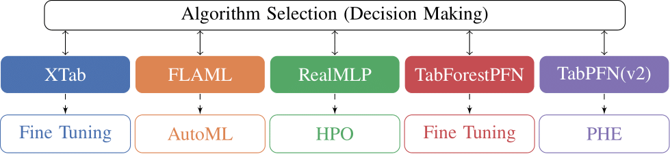
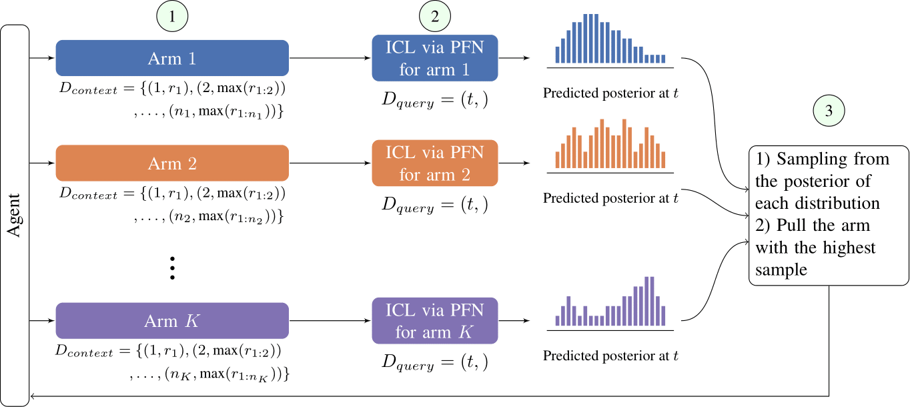

# CASH+
In-Context Decision Making for Optimizing Complex AutoML Pipelines
## Abstract
Combined Algorithm Selection and Hyperparameter Optimization (CASH) has been fundamental to traditional AutoML systems. However, with the advancements of pre-trained models, modern ML workflows go beyond hyperparameter optimization and often require fine-tuning, ensembling, and other adaptation techniques.
While the core challenge of identifying the best-performing model for a downstream task remains, the increasing heterogeneity of ML pipelines demands novel AutoML approaches. This work extends the CASH framework to select and adapt modern ML pipelines. We propose PS-PFN to efficiently explore and exploit adapting ML pipelines by extending Posterior Sampling (PS) to the max k-armed bandit problem setup. PS-PFN leverages prior-data fitted networks (PFNs) to efficiently estimate the posterior distribution of the maximal value via in-context learning. We show how to extend this method to consider varying costs of pulling arms and to use different PFNs to model reward distributions individually per arm. Experimental results on one novel and two existing standard benchmark tasks demonstrate the superior performance of PS-PFN compared to other bandit and AutoML strategies.

## Overview

We extend the Combined Algorithm Selection and Hyperparameter Optimization (CASH) to CASH+. The main advantage of CASH+ is its ability to handle heterogeneous performance optimization strategies, making it suitable for modern ML workflows.

<p align="center">
  
</p>  

The problem is formulated as a two-level optimization task, where the top level corresponds to a Max-K-Armed Bandit (MKB) problem. Posterior Sampling (PS) is employed to optimize the maximal reward in this context.

<p align="center">
  
</p>  


## **Project Structure**  
The repository is organized as follows:

```
CASHPlus
├── Analysis/          # Scripts and code for analyzing trajectories
├── assets/            # Visuals and diagrams illustrating approaches 
├── BudgetAwareBandits/ # Code for applying bandit algorithms to the generated HPO trajectories 
├── Datasets/          # Place datasets here; split them according to the provided notebook in this directory
├── PFN4CASHPlus/      # Code for training a PFN based on our priors
├── Policies/          # Implementations of bandit algorithms
├── Trajectories/      # Scripts and configurations for generating trajectories 
└── README.md          # Project overview and documentation
```

## **Contributions**  
We welcome feedback and contributions! Please submit an issue or a pull request to help improve this repository.  Feel free to adapt and extend this codebase as needed for your own experiments and research.